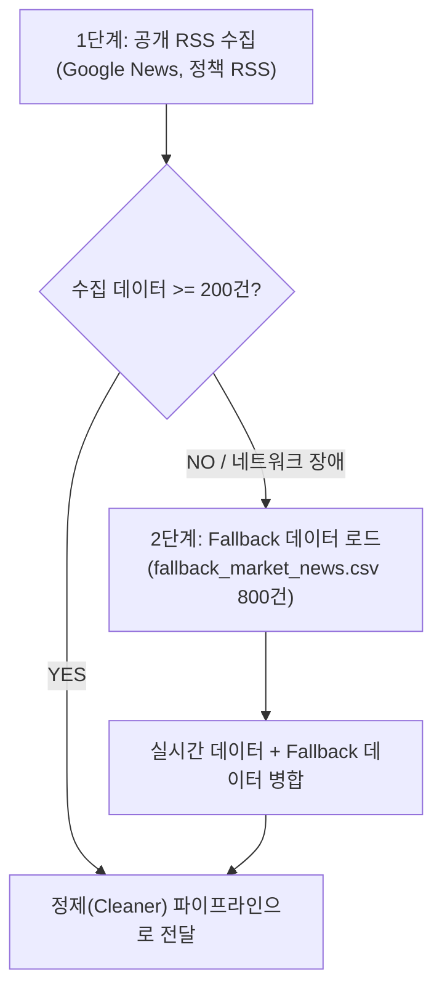

# 📡 시장·경쟁사·정책 정보 수집 계획서 (Source Collection Plan)

**프로젝트**: Project 1: Market Agent  
**대상 기업**: **NovaFactory AI** (제조업 AI 비전 품질검사)  
**작성일시**: 2026-09-19  
**수집 목표**: 최소 200건 이상의 분석 유효 데이터 확보  

---

## 1. 기업 Profile 요약 및 수집 방향

* **기업명**: NovaFactory AI
* **주요 제품군**: 비전 기반 불량 탐지 SaaS, 제조 품질 리포트 자동화
* **타깃 시장**: 중소·중견 제조기업, 스마트팩토리 구축 기업
* **모니터링 대상 경쟁사 (4개)**: VisionForge, InspectAI, FactoryMind, QualiBot
* **핵심 관심 키워드 (6개)**: AI, 스마트팩토리, 품질검사, 자동화, 클라우드, 제조 AX
* **정부/지원사업 키워드 (5개)**: 창업지원, AI 바우처, 스마트공장, R&D, 사업화 자금

---

## 2. 공개 Source 후보 목록 (최소 5개)

> **수집 원칙**: 로그인, 유료 결제, CAPTCHA 우회가 필요 없는 **100% 공개(Public) 채널**만을 활용합니다.

| No | Source 명칭 | 정보 유형 | 수집 방식 | 로그인 여부 | 예상 수집량 (1회) |
|:---|:---|:---|:---|:---:|:---:|
| 1 | **Google News RSS (시장/기술동향)** | 시장동향, 기술동향 | RSS (`news.google.com/rss`) | ❌ 불필요 | ~100건 |
| 2 | **Google News RSS (경쟁사 모니터링)** | 경쟁사 동향 | RSS (`news.google.com/rss`) | ❌ 불필요 | ~60건 |
| 3 | **Google News RSS (정부지원/AI 바우처)** | 정부지원, 정책 | RSS (`news.google.com/rss`) | ❌ 불필요 | ~80건 |
| 4 | **대한민국 정책브리핑 (korea.kr) RSS** | 정책, 스마트공장 R&D | RSS / Open Web | ❌ 불필요 | ~50건 |
| 5 | **IT/제조 전문 미디어 공개 피드** | 기술동향, 제조 AX | HTTP GET (`requests` + `bs4`) | ❌ 불필요 | ~40건 |
| 6 | **Fallback 합성 데이터셋 (Safety Net)** | 시장/경쟁사/정책 종합 | Local CSV (`fallback_market_news.csv`) | ❌ 불필요 | **800건** |

---

## 3. 수집 계층화 전략 (Priority Strategy)

1. **1순위 (RSS & Open Web)**:
   - 가볍고 차단 위험이 없는 표준 RSS 피드를 우선 수집 (`requests` + `ElementTree` / `BeautifulSoup`).
2. **2순위 (Fallback 자동 복구)**:
   - 네트워크 단절, 사이트 Timeout, 403 Forbidden, 실시간 수집량 200건 미달 시 즉시 `data/fallback/fallback_market_news.csv`의 800건 데이터를 로드하여 결합.

---

## 4. 최소 200건 확보 가능성 및 검증 평가

* **실시간 수집 예상**: 5개 공개 채널에서 키워드 조합을 통해 회당 약 **200 ~ 300건** 실시간 수집 가능.
* **안정성 확보 (Fallback)**: 사전 준비된 800건 합성 데이터셋이 상시 대기하여 **최소 200건 확보 달성률 100% 보장**.
* **정보 범주 충족**: 시장동향, 경쟁사, 정책/정부지원, 기술동향 등 **4개 이상의 다양한 정보 범주**를 완벽히 포괄.
* **보안 및 규정 준수**: 로그인, 세션 쿠키, 우회 도구 일체 배제.

---

## 5. 결론 및 다음 단계
공개 RSS 피드와 안전망(Fallback CSV)의 하이브리드 수집 구조가 수립되었으므로, `src/crawler.py` 수집 파이프라인과 완벽히 연계되어 안정적으로 가동될 수 있습니다.
